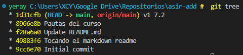
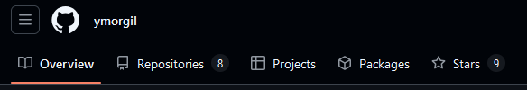
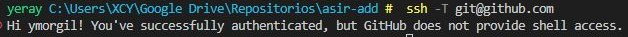
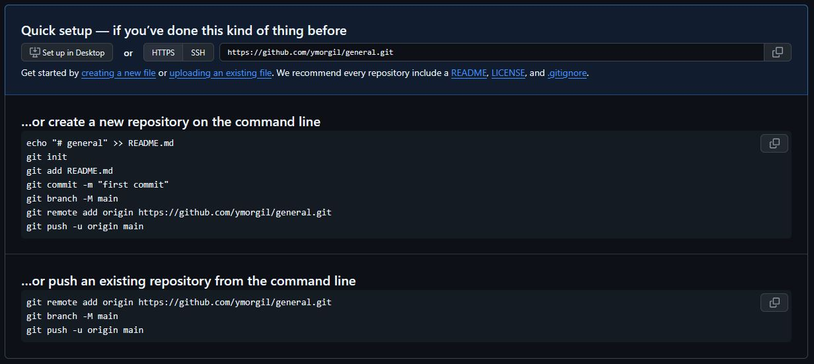
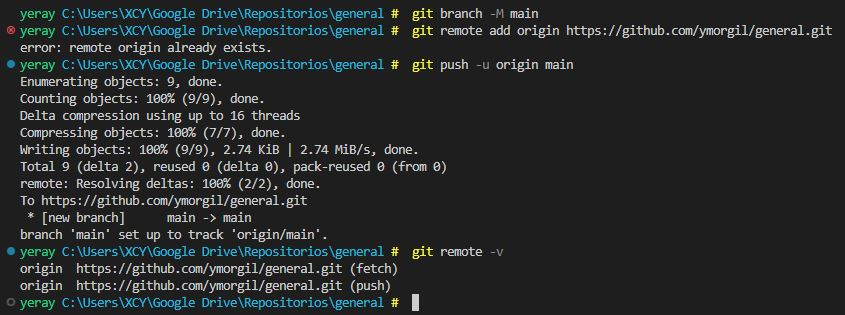
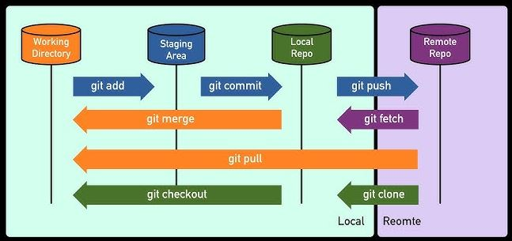

# **:cyclone: 1.1 CONTROL DE VERSIONES**
&nbsp;
---

- [**:cyclone: 1.1 CONTROL DE VERSIONES**](#cyclone-11-control-de-versiones)
- [**1. 💻 CONCEPTOS BÁSICOS DE GIT**](#1--conceptos-básicos-de-git)
  - [Configuración](#configuración)
  - [Comandos básicos](#comandos-básicos)
- [**2. 🌿 RAMAS**](#2--ramas)
  - [Comandos básicos para ramas](#comandos-básicos-para-ramas)
  - [Ramas remotas en Git](#ramas-remotas-en-git)
  - [Comandos de historial y navegación](#comandos-de-historial-y-navegación)
  - [Creación de alias](#creación-de-alias)
- [**3. 🐱 GITHUB**](#3--github)
  - [Repositorios](#repositorios)
  - [Repositorio remoto en GitHub](#repositorio-remoto-en-github)
    - [**⇒ 01 GitHub**](#-01-github)
    - [**⇒ 02 Autenticación SSH**](#-02-autenticación-ssh)
    - [**⇒ 03 Sincronizar repositorios**](#-03-sincronizar-repositorios)
  - [Flujo colaborativo](#flujo-colaborativo)
  - [Herramientas para Git y GitHub](#herramientas-para-git-y-github)
    - [Aplicaciones con interfaz gráfica](#aplicaciones-con-interfaz-gráfica)
    - [GitHub Pages](#github-pages)
- [**3. 📄 Markdown**](#3--markdown)
- [**4. 🌐Enlaces de interés**](#4-enlaces-de-interés)


&nbsp;
# **1. 💻 CONCEPTOS BÁSICOS DE GIT**
Git es un sistema de **control de versiones** distribuido diseñado para rastrear y gestionar cambios en archivos y proyectos de manera eficiente. Fue creado por Linus Torvalds en 2005 para gestionar el desarrollo del núcleo de Linux, pero rápidamente se convirtió en la herramienta más utilizada en el desarrollo de software. Este ayuda a los desarrolladores y equipos a colaborar de manera eficiente, manteniendo un registro completo de los cambios realizados en un proyecto. Es ideal para proyectos de software, pero también se puede usar para gestionar cualquier tipo de archivo, como documentos, páginas web o incluso proyectos creativos. Su uso garantiza la trazabilidad, la seguridad de los datos y la colaboración efectiva entre equipos. 

Para instalar Git, accede a la [web oficial de Git](https://git-scm.com/) y descárgalo según tu sistema operativo,de código libre y abierto, diseñado para manejar todo, desde pequeños hasta proyectos muy grandes con velocidad y eficiencia. Es recomendable comenzar trabajando con la terminal y, una vez comprendidos los conceptos, utilizar una GUI como **GitKraken o SourceTree**.

> Un **repositorio** de Git o GitHub es un espacio donde se guarda y gestiona el código fuente de un proyecto, incluyendo su historial de cambios. Git lo maneja de forma local y GitHub permite almacenarlo en la nube para colaborar con otras personas.

Comprobamos la versión instalada con:
```bash
# Comprobar versión
git -v

# Ayuda 
git --help
```

## Configuración
Para empezar a trabajar con Git, realiza las configuraciones globales para el nombre de usuario y correo electrónico:
```bash
git config --global user.name "ymorgil"
git config --global user.email "yerayeduc@gmail.com"

#Verificar
git config --list
```

## Comandos básicos
| Comando | Acción |
|---------|--------|
| `git init` | Inicializa un repositorio Git en el directorio actual. Al ejecutar Git crea una nueva carpeta oculta llamada **.git**, que contiene todos los archivos y configuraciones necesarias para hacer un seguimiento del historial de versiones. A partir de este momento, el directorio se convierte en un repositorio Git, y puedes comenzar a gestionar el código dentro de él. Este es el primer paso para iniciar el control de versiones de cualquier proyecto.|
| `git status` | Muestra estado actual de tu repositorio. Al ejecutarlo, Git te mostrará información sobre los archivos que han sido modificados, los que están en el área de preparación **(staging area)** listos para ser commiteados, y los archivos que aún no han sido añadidos. También te indicará si hay algún cambio que aún no se ha guardado en el repositorio, proporcionándote una visión clara de lo que ha ocurrido hasta el momento. |
| `git add <archivo>` | Añadir archivos individuales al área de preparación, también conocida como staging area. Esto le indica a Git que deseas incluir esos archivos modificados en el siguiente commit. Es una forma de organizar qué cambios se registrarán, permitiendo un control más detallado sobre qué se guarda en cada momento. Si tienes varios archivos modificados pero solo deseas incluir algunos en el próximo commit, puedes añadirlos todos utilizando git add.|
| `git add .` | Añade todos los archivos modificados al área de preparación. |
| `git commit -m "mensaje"` | Este comando es utilizado para guardar los cambios en el repositorio. Al ejecutar git commit, Git toma todos los archivos que han sido añadidos al área de preparación mediante git add y los almacena en el historial del repositorio, creando un nuevo commit. El mensaje que proporcionas con -m debe ser una descripción breve pero clara de los cambios realizados. Este es un paso crucial en el proceso de control de versiones, ya que permite mantener un registro detallado de cada cambio en el proyecto. |

>El `stage area` lugar temporal donde eliges los archivos que quieres guardar. Es como una caja donde metes los cambios que quieres conservar. Luego, cuando estás listo, haces un commit, que es como sacar una "foto" de esos cambios para que queden guardados en el historial del proyecto.
**Stage area** = eliges qué cambios guardar. 
**Commit** = guardar esos cambios de forma definitiva en el proyecto (como una foto del momento)

>Fichero `.gitignore` es donde podemos poner nombres de archivos o expresiones regulares que obtenga aquellos archivos que nosotros no queramos tener en cuenta a la hora de hacer los commit. Una vez agregados cuando hacemos el **git status** no saldrá en el listado estos archivos.


# **2. 🌿 RAMAS**
Imagina que tu proyecto es un árbol, el **tronco** sería la rama principal (`main` o `master`) y cada **rama** nueva es como una rama lateral donde puedes trabajar sin tocar el código principal. Esta rama es una **copia** del estado actual del proyecto y puedes trabajar ahí sin afectar otras ramas. Además, puedes fusionarla (**merge**) con la principal para añadir tus cambios. En otras palabras es una versión alternativa del proyecto donde puedes hacer cambios sin afectar la versión principal. Se usa para:
- Probar nuevas ideas o funciones sin romper el código que ya funciona.
- Trabajar en equipo, donde cada persona trabaja en su propia rama.
- Organizar el desarrollo, separando tareas como corregir errores o añadir mejoras.

## Comandos básicos para ramas
| Comando | Acción |
|---------|--------|
| `git branch` | Ver ramas existentes |
| `git branch nombre_rama` | Crear una nueva rama |
| `git checkout nombre_rama` | Cambiar a otra rama |
| `git checkout -b nombre_rama` | Crear y cambiar a una nueva rama en un solo paso |
| `git branch -m nuevo_nombre` | Renombrar una rama |
| `git branch -d nombre_rama` | Borrar una rama local |
| `git merge nombre_rama` | Fusiona la rama indicada con la rama actual. |

>Conflictos en git surge surge cuando al fusionar varias ramas, los equipos han modificado el mismo fichero. Si las modificaciones están en líneas diferentes del mismo archivo, Git puede fusionar sin conflicto. Si están en la misma línea, Git te pedirá que resuelvas el conflicto manualmente.

## Ramas remotas en Git
**Ramas remotas** son como "copias en la nube" de tus ramas locales guardada en un **repositorio remoto** (por ejemplo, GitHub, GitLab o Bitbucket).

- Una **rama local** vive en tu ordenador.
- Una **rama remota** vive en el servidor del proyecto. Normalmente se llama `origin` por defecto.
- Ambas ramas pueden sincronizarse para compartir cambios.

Las ramas remotas permiten:
- Compartir tu trabajo con otras personas.
- Recibir actualizaciones del equipo.
- Mantener una copia de seguridad del proyecto.

| Comando | Acción |
|---------|--------|
| `git pull origin nombre_rama` | Traer y fusionar cambios de una rama remota a tu rama local. (**Descargar**) |
| `git pull` | Sincroniza antes de trabajar para evitar conflictos. |
| `git push origin nombre_rama` | Subir tu rama local al remoto |
| `git push origin --delete nombre_rama` | Eliminar una rama remota |

## Comandos de historial y navegación
| Comando                                         | Descripción                                  |
|------------------------------------------------|----------------------------------------------|
| `git log`                                       | Lista los commits realizados.                 |
| `git log --graph`                              | Muestra el historial como un gráfico.        |
| `git log --all --graph --pretty=oneline --decorate --oneline` | Historial en formato compacto y gráfico.     |
| `git checkout <id_del_commit>`                  | Cambia a un commit específico.                |
| `git diff`                                      | Compara cambios entre commits o ramas.       |
| `git reset <id>`                                | Revierte al commit especificado.              |
| `git reset --hard`                              | Sobrescribe todos los cambios no guardados.  |
| `git reflog`                                    | Muestra todos los commits realizados, incluso los borrados. |
| `git tag`                                       | Etiqueta commits.                             |

## Creación de alias
Los alias se pueden crear de forma global. Por ejemplo, para un alias que muestra los logs en formato de árbol:
```bash
git config --global alias.tree "log --all --graph --pretty=oneline --decorate --oneline"
```
 - ``--all``: Muestra el historial de todas las ramas, incluidas las ramas remotas y locales.
 - ``--graph``: Representa gráficamente el historial de confirmaciones como un árbol con líneas que conectan las ramas y fusiones.
 - ``--pretty=oneline``: Muestra cada commit en una sola línea, lo que proporciona un resumen compacto del historial.
 - ``--decorate``: Añade información adicional sobre las referencias, como nombres de ramas o etiquetas, asociadas a cada commit.
 - ``--oneline``: Es un atajo para combinar --pretty=oneline y limitar la salida del identificador de cada commit a su abreviatura.

Para ejecutarlo, usa:
```bash
git tree
```


# **3. 🐱 GITHUB**
Plataforma de desarrollo colaborativo basada en la web que utiliza Git como sistema de control de versiones. Permite a los desarrolladores almacenar y gestionar proyectos de software, así como colaborar con otros usuarios. GitHub ofrece un entorno donde los usuarios pueden trabajar de manera conjunta en proyectos de código abierto y privado, facilitando la administración de versiones de código y el seguimiento de cambios realizados en el repositorio a lo largo del tiempo.


         
> `Overview`: **Visión general** del repositorio o perfil. En ella, puedes encontrar información importante sobre el proyecto, como una descripción, estadísticas clave, como el número de commits recientes, contribuciones y otros detalles relevantes. También puedes ver información de la comunidad y actividades recientes, como pull requests abiertos o cerrados, y issues.

> `Repositories`: **Lista de todos los repositorios** que el usuario ha creado o en los que tiene participación. Cada repositorio se presenta con su nombre, una breve descripción, el estado actual (activo o archivado) y la fecha del último commit. Desde esta pestaña, los usuarios pueden acceder directamente a cualquiera de sus repositorios para explorar el código, realizar modificaciones o colaborar con otros.

> `Projects`: **Gestionan los proyectos** dentro de GitHub. Los proyectos son tableros o listas de tareas que ayudan a organizar y seguir el progreso de un conjunto de issues o tareas dentro de un repositorio. Aquí, puedes crear un nuevo proyecto, añadir columnas (como "Pendiente", "En progreso", "Finalizado") y asociar issues o pull requests a esas columnas, facilitando así el seguimiento y la colaboración en tareas específicas.

> `Packages`: **Gestionar los paquetes o dependencias** que se utilizan dentro del repositorio o que el repositorio mismo publica. GitHub permite almacenar y compartir paquetes de software, como bibliotecas o herramientas, mediante GitHub Packages. Esta sección ofrece un espacio para ver y gestionar los paquetes publicados, incluyendo las versiones disponibles y las configuraciones relacionadas con su uso.

> `Stars`: **Repositorios que te gustan** o encuentras útiles. Al dar una estrella a un repositorio, lo estás marcando como favorito y lo añades a tu lista de repositorios favoritos. Esto sirve como una herramienta de organización personal, pero también permite a otros ver qué proyectos has encontrado interesantes o valiosos. Los repositorios con muchas estrellas suelen ser populares y bien valorados dentro de la comunidad de GitHub.

## Repositorios 
Un **repositorio** es un espacio donde se guarda el código de un proyecto junto con su historial de cambios. Gracias a los repositorios, podemos llevar un control detallado de todas las versiones y colaborar con otras personas de forma ordenada. Una vez creada la cuenta en GitHub, puedes crear todos los repositorios que desees, tanto públicos como privados.

| Repositorio    | Tipo               |
|---------------|------------------------|
| Repositorio Local         | Se encuentra en tu propio ordenador. Aquí realizas tus cambios, añades archivos y guardas las versiones usando Git. Puedes trabajar sin conexión, y una vez que quieras compartir tu trabajo, sincronizas los cambios con un repositorio remoto.        |
| Repositorio Remoto        | Está alojado en un servidor, por ejemplo, en GitHub. Sirve para compartir tu proyecto con otros usuarios o para tener una copia de seguridad en la nube. Se conecta con el repositorio local para subir y descargar cambios.|
|Repositorio Principal| Con el mismo nombre que tu cuenta tiene un propósito especial, ya que puede ser utilizado para alojar una página web personal usando **GitHub Pages**, y también sirve como punto de referencia para otros proyectos que puedas tener. Además, cualquier cambio realizado en este repositorio principal se reflejará directamente en tu perfil de GitHub, lo que lo convierte en una vitrina de tu trabajo y contribuciones.  `https://github.com/<usuario>/<repositorio>`.|


## Repositorio remoto en GitHub
La sincronización entre un repositorio local y su contraparte en GitHub permite mantener actualizados los cambios realizados en tu máquina con la copia almacenada en la nube, garantizando así un flujo de trabajo continuo y seguro. Este proceso facilita la colaboración entre varios desarrolladores, ya que todos pueden acceder a la última versión del proyecto y aportar modificaciones de forma coordinada. Además, ofrece ventajas como el respaldo automático de tu trabajo, la posibilidad de trabajar desde diferentes dispositivos sin perder cambios, el control de versiones para recuperar estados anteriores y la integración con herramientas de desarrollo. A continuación, los pasos básicos para trabajar de manera eficiente:

### **⇒ 01 GitHub**
Crear una cuenta en GitHub es un proceso sencillo que te permite acceder a la plataforma de control de versiones y almacenamiento de código en la nube. Para ello, basta con visitar [https://github.com](https://github.com) y pulsar en "Sign up", donde deberás proporcionar un nombre de usuario único, un correo electrónico válido y una contraseña segura. Una vez completados estos datos, GitHub te guiará a través de la verificación de tu correo electrónico y la configuración inicial de tu perfil, incluyendo opciones como la visibilidad de tus repositorios y preferencias de notificación. Tener una cuenta en GitHub te da acceso a crear repositorios, colaborar en proyectos de otros usuarios y utilizar herramientas de gestión de versiones de manera eficiente.

### **⇒ 02 Autenticación SSH**
Configurar la autenticación SSH con GitHub te permite establecer una conexión segura entre tu máquina local y GitHub sin necesidad de introducir tu usuario y contraseña en cada operación. Esto se logra mediante un par de claves criptográficas, una privada que se guarda en tu equipo y una pública que se asocia a tu cuenta de GitHub.

Para comenzar, primero verifica si ya tienes un par de claves SSH existente ejecutando el comando `ls -al ~/.ssh`. Si en la salida aparecen archivos como `id_ed25519` y `id_ed25519.pub` significa que ya tienes una clave generada y podrías reutilizarla. En caso contrario, debes generar un nuevo par de claves con `ssh-keygen -t ed25519 -C "tuemail@example.com"`. Este comando crea una clave segura y la asocia a tu correo electrónico de GitHub. 

Una vez creada, es necesario añadir la clave privada al agente SSH para que se gestione automáticamente. Inicia el agente con `eval "$(ssh-agent -s)"` y añade tu clave con `ssh-add ~/.ssh/id_ed25519`. Después de esto, obtén el contenido de la clave pública usando `cat ~/.ssh/id_ed25519.pub` y copia todo el texto que se muestre, que empezará por `ssh-ed25519`.

El siguiente paso es registrar esta clave pública en GitHub. Para ello, inicia sesión, entra en **Settings → SSH and GPG keys**, pulsa en **New SSH key**, escribe un título descriptivo para identificar el dispositivo y pega la clave pública en el campo correspondiente. Guarda los cambios y la clave quedará vinculada a tu cuenta.

Para verificar que la conexión funciona correctamente, utiliza `ssh -T git@github.com`. Si todo está bien, recibirás un mensaje indicando que la autenticación fue exitosa.



Para más información y detalles, consulta la documentación oficial de GitHub sobre [configuración de SSH](https://docs.github.com/es/authentication/connecting-to-github-with-ssh).

### **⇒ 03 Sincronizar repositorios**
Cuando ya tienes un repositorio local (**con algún commit**) y deseas subirlo a GitHub, primero es necesario crear un repositorio vacío en GitHub. Esto se hace desde la plataforma web pulsando en **New repository**, eligiendo un nombre para el repositorio y asegurándote de no añadir archivos como README, `.gitignore` o licencia si ya existen en tu proyecto local, para evitar conflictos. Una vez creado el repositorio en GitHub, obtienes la URL del mismo, esta se utiliza para enlazar tu repositorio local con el remoto mediante el comando `git remote add origin <URL-del-repositorio>`. 



A partir de este momento,asegúrate de que tu rama principal se llama `main` con `git branch -M main` y sube el contenido con `git push -u origin main`. Es recomendable usar `git push -u origin main` la primera vez para establecer la relación entre la rama local y la remota. Después de eso, podrás usar simplemente `git push` para actualizar los cambios.



| Comandos | Descripción |
|---------|-------------|
| `git remote` | Gestiona la conexión entre el repositorio local y los remotos. Sin parámetros, muestra los nombres de los remotos configurados (por defecto `origin`). Con `-v`, muestra las URL asociadas diferenciando entre "fetch" (obtener) y "push" (enviar). |
| `git push` | Sube los commits confirmados en local a un repositorio remoto, actualizando la rama remota correspondiente. Sintaxis: `git push origin nombre-de-la-rama`. |
| `git fetch` | Obtiene las últimas actualizaciones del remoto sin modificar el área de trabajo local. Descarga cambios de ramas remotas, pero no los fusiona. Para integrarlos, usa `git merge` o `git pull`. |
| `git pull` | Combina `git fetch` y `git merge`: descarga cambios del remoto y los fusiona automáticamente con la rama local. |
| `git clone` | Crea una copia completa de un repositorio remoto en local, incluyendo historial de commits, ramas y archivos. Sintaxis: `git clone <url_del_repositorio>`. |



## Flujo colaborativo
Conjunto de prácticas y herramientas que permiten a los desarrolladores trabajar de manera conjunta y eficiente en un proyecto, gestionando versiones, contribuciones y revisiones de código de forma ordenada. GitHub, al ser una plataforma basada en Git, facilita la colaboración en proyectos a través de repositorios remotos y diversas funcionalidades como pull requests, branches y revisiones de código. **Procedimiento:**

**1. Haz un "fork" del repositorio** 
>   Significa crear una copia del repositorio original bajo tu cuenta de GitHub. Esto te permite experimentar y hacer cambios en el código sin modificar el proyecto original. Es un paso necesario para contribuir a proyectos de código abierto donde no tienes permisos directos de escritura.

**2. Clona el fork en local** 
> Una vez que has hecho un fork, el siguiente paso es clonar el repositorio a tu máquina local con el comando `git clone`. Esto crea una copia exacta de tu repositorio en tu computadora, permitiéndote realizar cambios de manera local antes de enviarlos de vuelta a GitHub.

**3. Realiza cambios, añade commits y sube los cambios con `git push`**
   >Después de clonar el repositorio, puedes hacer cambios en el código. Una vez realizados los cambios, debes hacer un commit para guardarlos en tu repositorio local. Luego, subes esos cambios al repositorio remoto (tu fork) utilizando `git push`. Esto permite que tus modificaciones estén disponibles en GitHub.

**4. Sincroniza el fork si hay cambios en el repositorio original**
   > Si otros colaboradores han realizado cambios en el repositorio original después de hacer tu fork, es importante mantener tu fork actualizado. Esto se hace sincronizando tu fork con el repositorio original mediante comandos como `git fetch` y `git merge`, para que puedas integrar los cambios más recientes antes de enviar tu pull request.

**5. Propón cambios mediante un "pull request"**
   > Una vez que hayas subido tus cambios a tu repositorio remoto, el siguiente paso es abrir un pull request (PR) en el repositorio original. Esto es una solicitud para que el propietario del repositorio revise tus cambios y los integre en el proyecto principal. El PR facilita la discusión y revisión del código propuesto.

**6. El propietario del repositorio original revisará y aceptará los cambios**
   > El propietario o mantenedor del repositorio original revisará los cambios propuestos en el pull request. Si todo está correcto, lo fusionará con la rama principal del repositorio. Si es necesario, puede pedir modificaciones adicionales antes de aceptar el PR. Una vez aprobado, los cambios se incorporan oficialmente al proyecto.

## Herramientas para Git y GitHub

### Aplicaciones con interfaz gráfica
Permiten gestionar repositorios sin usar exclusivamente la línea de comandos. Facilitan tareas como crear commits, revisar el historial, resolver conflictos, manejar ramas y sincronizar con repositorios remotos en GitHub mediante botones, menús y paneles interactivos. Ejemplos populares incluyen GitHub Desktop, Sourcetree, GitKraken o la integración gráfica que ofrecen editores como Visual Studio Code. Estas herramientas son útiles para quienes están empezando o prefieren una experiencia visual, aunque conocer los comandos básicos de Git sigue siendo esencial para un control total del flujo de trabajo.

- [GitHub Desktop](https://desktop.github.com/)
- [GitKraken](https://www.gitkraken.com/)
- [SourceTree](https://www.sourcetreeapp.com/)

### GitHub Pages
Servicio gratuito que permite a los usuarios crear y alojar sitios web directamente desde un repositorio de GitHub. Este servicio es ideal para proyectos personales, blogs, portafolios, documentación de proyectos, entre otros. Los usuarios pueden configurar un repositorio con archivos estáticos (HTML, CSS, JavaScript) y GitHub Pages se encarga de alojar el contenido en línea, generando una URL específica bajo el dominio github.io. La configuración y actualización de los sitios web se realiza directamente desde el repositorio en GitHub, lo que facilita el control de versiones, la colaboración y la automatización del proceso de publicación.

> **Hugo**: Generador de sitios estáticos de código abierto que permite crear sitios web rápidos y eficientes a partir de contenido escrito en archivos de texto (Markdown). Hugo convierte estos archivos en páginas web completamente funcionales, generando el código HTML necesario para visualizar las páginas en el navegador. Es conocido por su rapidez en la construcción del sitio, gracias a su capacidad de procesamiento de contenido y plantillas. Hugo es ampliamente utilizado para crear blogs, documentación de proyectos y sitios web personales debido a su flexibilidad y facilidad de uso. Una de sus ventajas es la integración con plataformas como GitHub Pages, donde se puede alojar un sitio Hugo sin necesidad de servidores complejos, simplemente generando los archivos estáticos y subiéndolos a un repositorio en GitHub.

# **3. 📄 Markdown**
Markdown es un lenguaje de marcado ligero diseñado para ser fácil de leer y escribir, utilizado principalmente para convertir texto plano en contenido estructurado que se puede convertir a HTML. Su sintaxis es simple y consiste en una serie de símbolos y caracteres especiales que permiten dar formato al texto, como encabezados, negritas, listas, enlaces, imágenes, entre otros, sin perder la legibilidad del texto original.

Su uso es muy común en plataformas de colaboración en línea, como GitHub, Reddit, y muchas otras, donde los usuarios pueden escribir documentos, comentarios o documentación técnica de manera sencilla y efectiva. Los desarrolladores lo utilizan para escribir archivos README, documentación de proyectos o incluso para redactar mensajes en foros y blogs. La principal ventaja de Markdown es que, aunque se usa para generar contenido con formato, el texto es legible y fácilmente editable como texto plano. Además, se puede convertir de manera eficiente a otros formatos, como HTML, lo que lo convierte en una herramienta muy popular para crear contenido web.

> Sintaxis básica

| Element         | Markdown Syntax                           |
|-----------------|-------------------------------------------|
| **Heading**     | `# H1`<br>`## H2`<br>`### H3`             |
| **Bold**        | `**bold text**`                           |
| **Italic**      | `*italicized text*`                       |
| **Blockquote**  | `> blockquote`                            |
| **Lista ordenada**| `1. First item`<br>`2. Second item`<br>`3. Third item` |
| **Lista desordenada**| `- First item`<br>`- Second item`<br>`- Third item` |
| **Código**        | `` `code` ``                              |
| **Línea Horizontal** | `---`                                  |
| **Enlace**        | `[title](https://www.example.com)`        |
| **Imagen**       | ``                  |

# **4. 🌐Enlaces de interés**
- [Web oficial Git](https://git-scm.com/)
- [Libro de Git en español](https://git-scm.com/book/es/v2)
- [Documentación de GitHub](https://docs.github.com/)
- [Configuración SSH](https://docs.github.com/es/authentication/connecting-to-github-with-ssh)
- [GitHub Pages](https://pages.github.com/)
- [GitHub Actions](https://github.com/features/actions)
- [Retos de programación de la comunidad](https://github.com/mouredev/)
- [Guía de Markdown en GitHub](https://docs.github.com/es/get-started/writing-on-github)
- [Sintaxis de Markdown](https://markdown.es/sintaxis-markdown/)