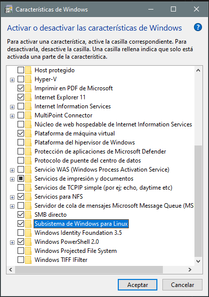

## WSL (Windows Subsystem for Linux)
---
WSL es una característica de Windows que permite ejecutar un entorno Linux directamente sobre Windows, sin necesidad de una máquina virtual ni de arranque dual. Gracias a WSL es posible usar herramientas de línea de comandos de Linux, ejecutar scripts Bash y trabajar con aplicaciones Linux integradas en el flujo de trabajo de Windows.

### **Activación y puesta en marcha**

#### 👉 Paso 1 — Activar características de Windows
 
Abrir **Características de Windows** y activar:
 
- Plataforma de máquina virtual
- Subsistema de Windows para Linux
 

 
---
 
#### 👉 Paso 2 — Instalación de WSL + Ubuntu 24.04
 
Abrir **PowerShell** como administrador y ejecutar:
 
```powershell

winget install Microsoft.WSL  # Instalar WSL con winget
 
wsl --version  # Comprobar la instalación
 
wsl --install -d Ubuntu-24.04  # Instalar Ubuntu 24.04
 
wsl --list --online # Si no aparece esa versión, listar las disponibles con:

```
 
La primera vez que arranque Ubuntu, el sistema solicitará crear:
- **Usuario** → nombre de usuario Linux
- **Contraseña** → se usará para `sudo`
 
Una vez dentro de Ubuntu, actualizar los paquetes:
 
```bash
sudo apt update && sudo apt upgrade -y && apt autoremove
```

# 🐳 Instalación de Docker + WSL + Portainer en Windows

Guía paso a paso para preparar un entorno con WSL, Ubuntu 24.04, Docker Desktop y Portainer.

# 👉 Paso 1: Activar características de Windows (WSL)

Abrir Características de Windows y activar:
 - Plataforma de máquina virtual
 - Subsistema de Windows para Linux



# 👉 Paso 2: Instalación de WSL + Ubuntu 24.04

## Powershell

```powershell
# Instalar WSL con winget
winget install Microsoft.WSL 
# Comprobar
wsl --version

# Instalar Ubuntu 24.04
wsl --install -d Ubuntu-24.04
# Si no aparece esa versión, puedes listar disponibles con:
wsl --list --online

```

La primera vez te pedirá:  [Usuario]  [Contraseña]

## Descargar terminal
La Terminal de Windows es una herramienta "todo en uno" que puedes obtener gratis desde la Microsoft Store; una vez instalada, basta con buscarla en el menú inicio para ejecutarla. Su principal ventaja es que permite abrir múltiples pestañas con diferentes entornos (como PowerShell o CMD) en una sola ventana, ofreciendo además una personalización total de colores y fuentes para que trabajar con comandos sea mucho más cómodo y visual.


## Actualizar Ubuntu

```bash
sudo apt update && sudo apt upgrade -y && apt autoremove
```

# 👉 Paso 3: Instalación de Docker Desktop + integración con WSL

### 3.1 Instalar Docker Desktop con winget en Windows

```powershell
winget install Docker.DockerDesktop
```

### 3.2 Abrir Docker Desktop

1. Iniciar Docker Desktop desde el menú de inicio
2. Esperar a que termine la configuración
3. Ir a:  **Settings → Resources → WSL Integration**
4. Activar:  Ubuntu-24.04

### Comprobar Docker desde Ubuntu

```bash
# Abrir Ubuntu y ejecutar:
docker --version
# Probar contenedor:
docker run hello-world
```

# 👉 Paso 4: Portainer

### Instalar Portainer

>Para instalar Portainer en Docker Desktop, lo más sencillo es utilizar las extensiones. Solo tienes que abrir Docker Desktop, ir a la sección Extensions en el menú lateral izquierdo y buscar "Portainer" en el buscador. Haz clic en el botón de instalar y la aplicación se encargará de descargar la imagen necesaria y configurar el contenedor de gestión automáticamente.

>Una vez instalado, verás el icono de Portainer en la barra lateral. Al hacer clic por primera vez, el sistema te pedirá crear una contraseña de administrador de al menos 12 caracteres para proteger el acceso. Tras este paso, selecciona el entorno "local" para que Portainer se conecte al motor de Docker de tu ordenador y puedas empezar a ver todos tus contenedores activos.

>Utilizarlo es muy intuitivo, ya que sustituye los comandos de la terminal por una interfaz gráfica. Desde el panel de control, puedes monitorizar el consumo de CPU y RAM de cada contenedor, revisar los logs en tiempo real para buscar errores o entrar directamente a la consola de una base de datos con un solo clic. Es ideal para gestionar redes y volúmenes de forma visual, algo que en Docker Desktop suele estar más limitado.

>Además, una de sus funciones más potentes son los Stacks, que te permiten desplegar aplicaciones completas copiando y pegando el código de tus archivos docker-compose.yml directamente en el navegador. Esto facilita enormemente el despliegue de proyectos complejos sin tener que gestionar archivos locales constantemente.


